# TonoEasy Consumer Marketplace

> A location-aware e-commerce marketplace that enables customers to discover stores and products, place orders, make payments, track deliveries, and manage their shopping experience from one platform.

---

## Overview

**TonoEasy Consumer Marketplace** is the customer-facing side of the TonoEasy ecosystem.

The platform allows customers to discover products from multiple stores, find stores near their location, add products to their cart, complete checkout, make payments, follow order progress, and track deliveries.

It was developed as a responsive web application designed to work across desktop, tablet, and mobile devices.

<p align="center">
  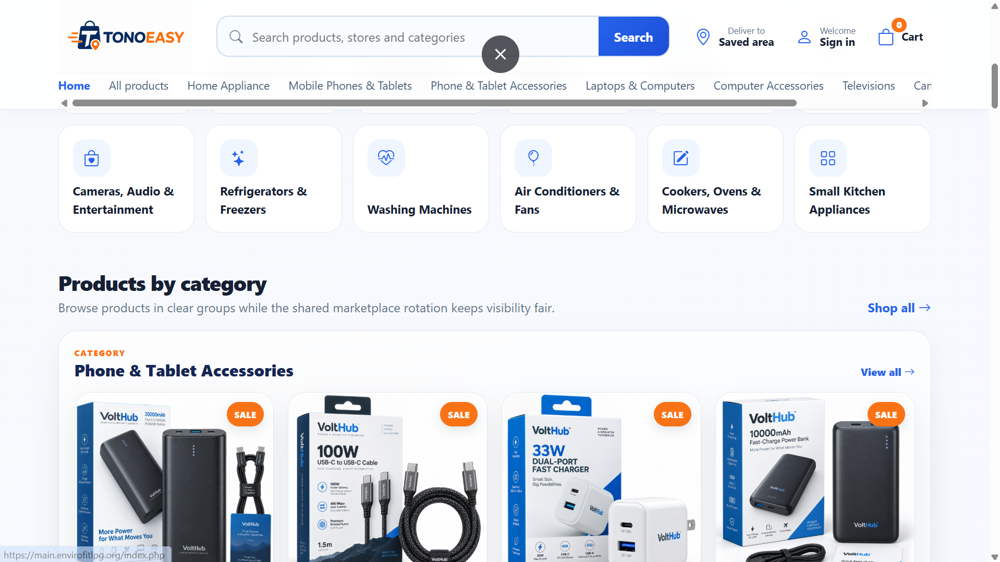
</p>

### Live Platform

**https://main.envirofitlpg.org**

---

## Purpose

The Consumer Marketplace was built to make shopping from multiple stores easier while connecting the purchasing process directly to store fulfilment and delivery operations.

Instead of customers having to interact separately with stores, riders, and payment providers, TonoEasy manages these activities through a connected marketplace workflow.

---

# Core Features

## Customer Accounts

Customers can create and manage accounts on the marketplace.

<p align="center">
  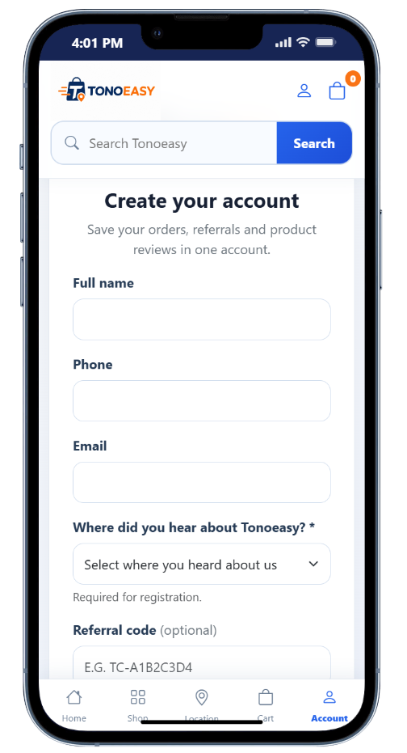
</p>

Features include:

- Customer registration
- Secure login
- Customer profile
- Saved addresses
- Order history
- Referral functionality
- Account notifications

---

# Product Marketplace

Customers can browse products available from participating stores.

<p align="center">
  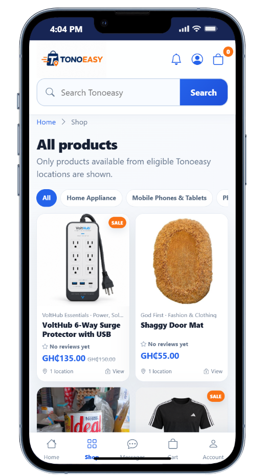
</p>

The marketplace supports:

- Product listings
- Product details
- Product categories
- Brand filtering
- Store filtering
- Product search
- Product images
- Multiple product images
- Product ratings
- Product reviews
- Promotional pricing
- Featured products

---

# Location-Based Shopping

TonoEasy includes location-aware functionality designed to make it easier for customers to find relevant stores.

<p align="center">
  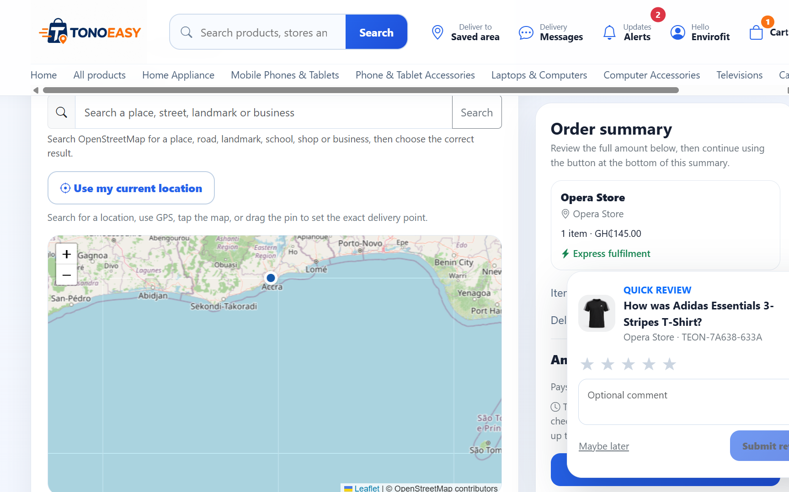
</p>

Customers can:

- Discover stores near their location
- Browse products by store
- Prioritize nearby stores
- View stores based on distance
- Select delivery locations

Location functionality also supports the delivery process after an order is placed.

---

# Shopping Cart

Customers can add products from the marketplace to their shopping cart.

<p align="center">
  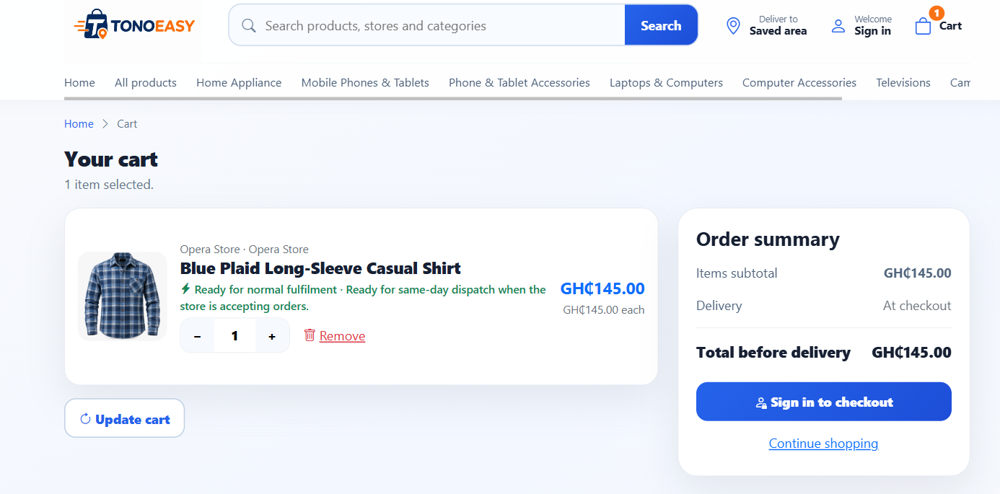
</p>

Cart functionality includes:

- Add to cart
- Update quantity
- Remove products
- View order subtotal
- Apply promotional discounts
- View estimated charges
- Proceed to checkout

Customers must be authenticated before completing checkout.

---

# Checkout

The checkout process collects the information required to complete an order.

<p align="center">
  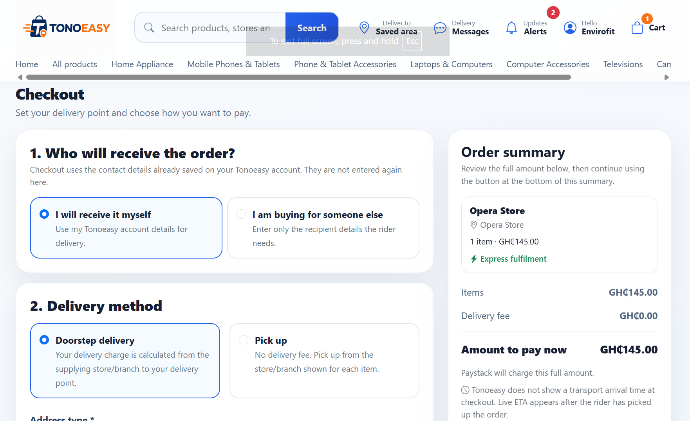
</p>
Customers can:

- Review selected products
- Select a delivery method
- Choose or provide a delivery address
- Apply promotional codes
- Select a payment method
- Review charges
- Confirm the order

---

# Payment Options

The marketplace supports multiple payment methods.

<p align="center">
  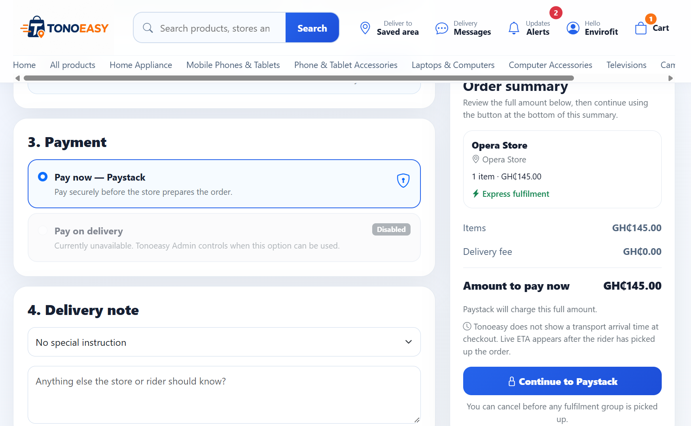
</p>

These include:

- Pay on Delivery
- Mobile Money
- Online payment through Paystack

The payment architecture is designed to support additional payment options as the platform grows.

---

# Promotional Codes

<p align="center">
  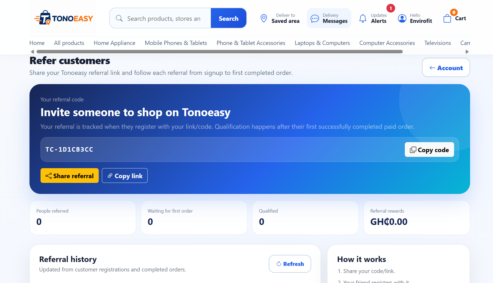
</p>

Customers can benefit from store and marketplace promotions.

Promotions can include:

- Coupon codes
- Percentage discounts
- Minimum-order requirements
- Product promotions
- Store promotions

---

# Multi-Store Shopping

The marketplace is designed to support products from multiple stores.

A customer can interact with products from different vendors while the platform handles the store-specific fulfilment process behind the scenes.

<p align="center">
  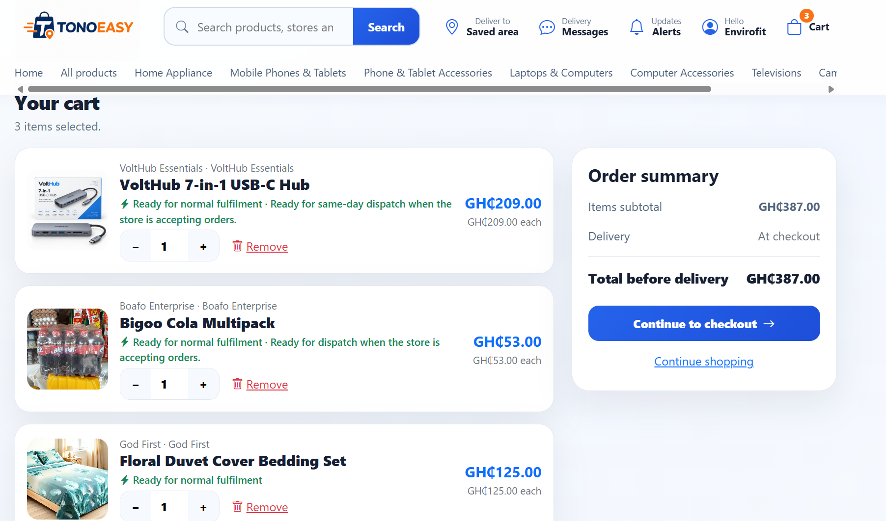
</p>

The system can manage:

- Products belonging to different stores
- Store-specific order items
- Store preparation status
- Multiple pickup locations
- Combined customer delivery workflows

---

# Order Management

Customers can view and follow their orders from placement through delivery.

<p align="center">
  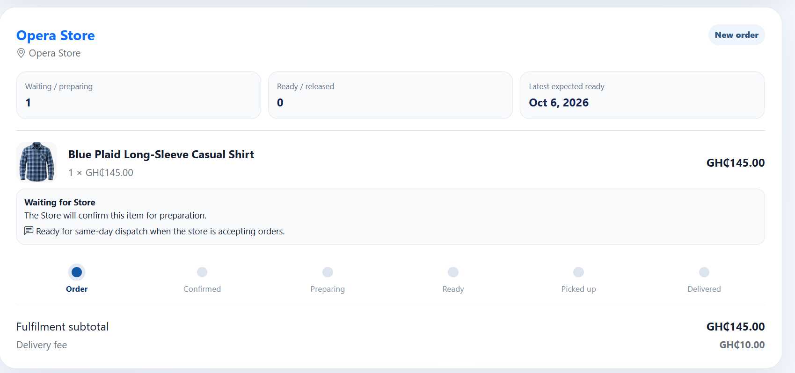
</p>

A typical order progresses through stages such as:

```text
Order Placed
     ↓
Pending
     ↓
Store Preparing
     ↓
Prepared
     ↓
Ready for Delivery
     ↓
Rider Pickup
     ↓
On the Way
     ↓
Delivered
```

Order statuses allow the customer to understand what is happening at each stage.

---

# Order Cancellation

Customers can cancel eligible orders before they reach the restricted delivery stage.

Cancellation rules help prevent orders from being cancelled after a rider has already collected them for delivery.

---

# Delivery Tracking

Once a rider collects an order, customers can access delivery tracking functionality.

<p align="center">
  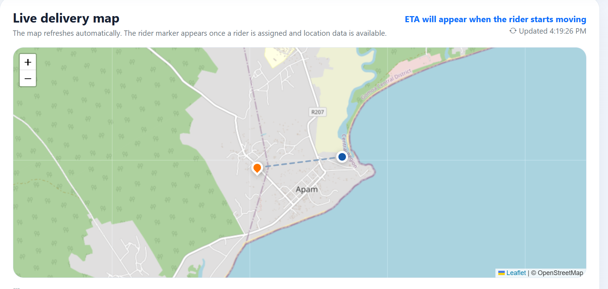
</p>

The tracking system can display:

- Store location
- Rider location
- Customer location
- Delivery progress
- Last known rider location

This gives customers better visibility into the delivery process.

---

# Product Reviews

Customers can leave reviews for products they have purchased.

Reviews are associated with actual order items, helping ensure that feedback comes from customers who interacted with the product through the marketplace.

<p align="center">
  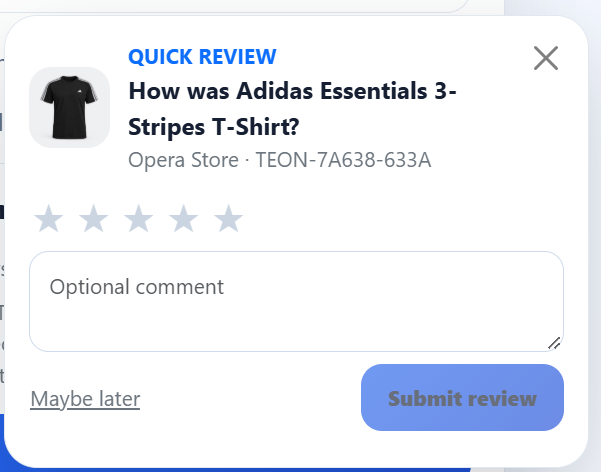
</p>

The review system can support:

- Ratings
- Written reviews
- Review approval
- Product-level feedback

---

# Notifications

Customers receive notifications about important activities.

<p align="center">
  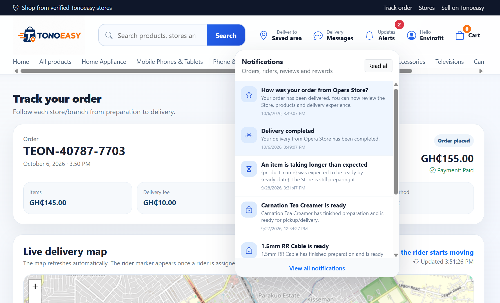
</p>

Examples include:

- Order confirmation
- Order preparation
- Delivery updates
- Rider pickup
- Order completion
- Promotions
- Account activity

---

# Advertising

The marketplace supports promotional placements that can be displayed to customers.

Examples include:

- Featured Products
- Homepage Banners
- Category Promotions
- Popup Advertisements

These features allow stores and platform administrators to promote products and campaigns.

---

# Referral System

The customer platform includes referral functionality.

Customers can receive a referral code that can be shared with other users during registration.

This provides a foundation for referral campaigns and customer acquisition programmes.

---

# Responsive Design

The marketplace is designed for different screen sizes.

Supported layouts include:

- Desktop
- Laptop
- Tablet
- Mobile

The customer interface prioritizes mobile usability because many customers access the marketplace through smartphones.

---

# Progressive Web App

The marketplace is designed to support Progressive Web App functionality.

PWA functionality can provide:

- Installable web application experience
- Application manifest
- Service worker support
- Mobile-friendly navigation
- Offline fallback
- App icons
- Improved application-like experience

---

# Technologies Used

## Backend

- PHP
- MySQL
- MySQLi
- Session Authentication
- REST/API integrations

## Frontend

- HTML5
- CSS3
- JavaScript
- jQuery
- AJAX
- Bootstrap

## Payments

- Paystack
- Mobile Money workflow
- Pay on Delivery

## Location & Maps

- Geolocation
- Google Maps
- Distance-based store functionality
- Delivery tracking

## Application

- Progressive Web App
- Service Workers
- Web App Manifest
- Responsive Web Design

---

# Customer Workflow

```text
Visit Marketplace
        ↓
Create Account / Login
        ↓
Browse Products
        ↓
Choose Product
        ↓
Add to Cart
        ↓
Review Cart
        ↓
Proceed to Checkout
        ↓
Select Delivery Option
        ↓
Choose Payment Method
        ↓
Place Order
        ↓
Store Prepares Order
        ↓
Rider Collects Order
        ↓
Track Delivery
        ↓
Receive Order
        ↓
Leave Review
```

---

# Main Data Areas

The customer marketplace works with data including:

```text
Customers
Customer Addresses
Stores
Store Branches
Products
Product Images
Categories
Brands
Shopping Cart
Orders
Order Items
Payments
Promotions
Coupons
Reviews
Notifications
Advertisements
Referrals
Delivery Information
```
